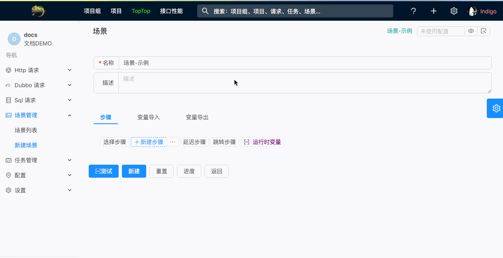
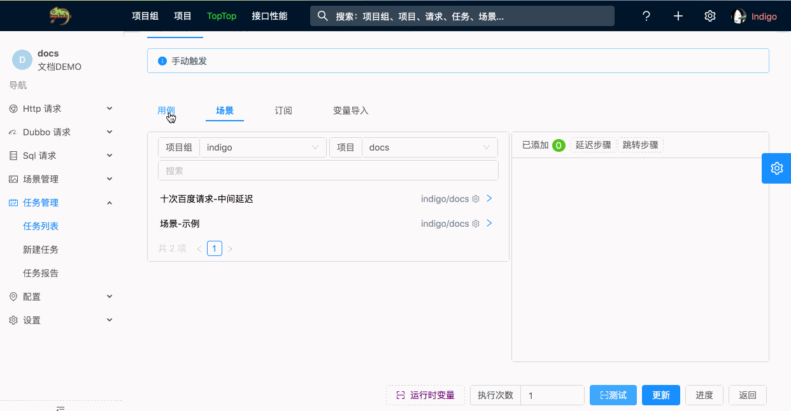
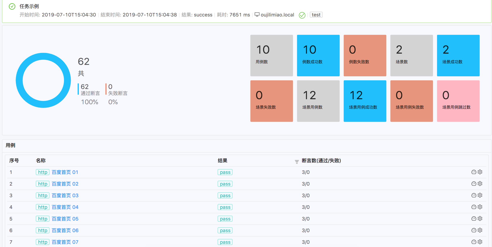
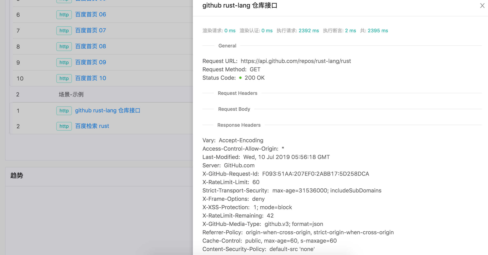

# Indigo


[](https://travis-ci.org/asura-pro/indigo)


---

## 关于 Indigo

`Indigo` 是一个测试接口的系统. 可以对 `Http(s)`, `Dubbo`, `MySql` 的请求响应进行断言. 一般用于企业内部接口的自动化测试, CI/CD Pipeline 节点, 线上巡检监控.

## 基本特性

#### 基于 Web UI 操作, 在线编辑和测试

> 使用 [Typescript](http://www.typescriptlang.org/), [Angular](https://angular.io/), [Ant Design](https://ng.ant.design/docs/introduce/zh) 技术实现. `Indigo` 的定位并非是一个框架而是一个开箱即用的测试系统, 对此设计了一套还算好用的 UI. 有 UI 的好处是, 相对与写脚本, 使用成本及其低, 且比使用脚本效率高 N 倍(大部分情况下, 尤其是当用例的数量非常大时). 但和其他基于脚本的接口测试框架相比, 必然缺少了一定的灵活性. 事实上大部分接口测试场景都很简单, 就是响应进行断言并没有很复杂的逻辑(那是业务系统的工作). `Indigo` 内置 Javascript 脚本引擎, 结合场景 其实灵活性也很高的.

#### 可维护高数量级的用例, 具备较高的并发执行性能

> `Indigo`的[后端](https://github.com/asura-pro/asura) 使用[Akka](https://akka.io/)框架作为底层基础实现. `Akka`是`JVM`上一个[Actor编程模型](https://doc.akka.io/docs/akka/current/guide/actors-motivation.html)的实现, 很适合用来构建高并发, 分布式和弹性消息驱动的应用. `Indigo`中使用了大量的`Actor`来对场景和任务进行抽象, 保证大量场景和任务同时执行过程中的状态隔离. `Indigo`中的数据, 包括基本的用例数据, 执行记录, 报告数据都存储在`Elastic Search`中.

#### 基于JSON的强大断言

> `Indigo`中断言被抽象为一个JSON结构体(JSON格式的DSL). [断言参考](https://docs.asura.pro/#/zh-cn/assertion)
``` json
{
  "$.entity.data" : {
    "$and" : [
      { "$.code" : { "$eq" : "10000" } },
      {
        "$.list" : {
          "$and" : [
            { "$type" : "array" },
            { "$size" : 10 }
          ]
        }
      }
    ]
  }
}
```

#### 场景和任务

> `场景`可以由一组顺序执行的不同类型的请求用例组成. 其中每一个步骤都可以导出变量供之后的请求使用. 可以把多个请求或场景组装成一个`任务`. `任务`可以通过接口, Cron定时或其他自定义事件源触发, 一般用于巡检监控和持续集成. 

---

## 截图示例

> 使用场景
> 

> 使用任务
> 

> 任务统计数据, 趋势图
> 

> 每次请求的详细数据
> 
